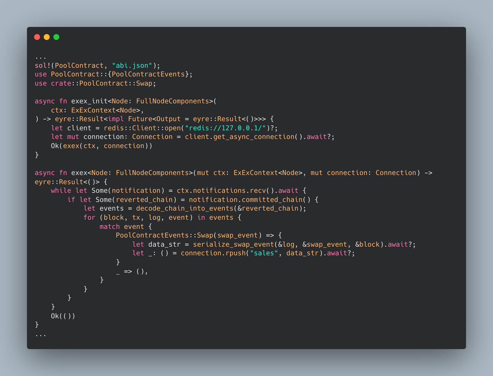

# Reth Execution Extensions Sales bot example 

Inspired by [Reth ExEx](https://github.com/paradigmxyz/reth/tree/main/examples/exex), this guide provides a simple and efficient way to monitor UniswapV3Pool's Swap events and store the event information in a Redis queue in <100 LoC. 



Redis is expected to be running locally with the default address and port.

To run this project

```
cargo run node  --chain genesis.json \
    --datadir genesis \
    --http --auto-mine -d
```

## Reference Links 

[Start with Reth][1]
[Introducing Reth Execution Extensions][2]

[1]: https://blog.superchain.network/inside-reth-the-journey-of-a-tranaction-through-ethereum/
[2]: https://www.paradigm.xyz/2024/05/reth-exex
